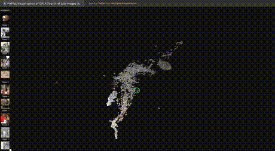
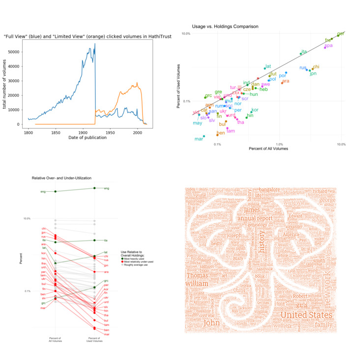
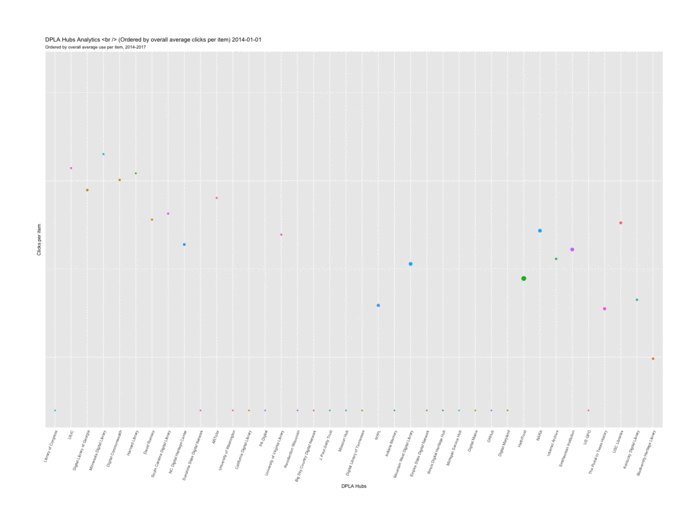
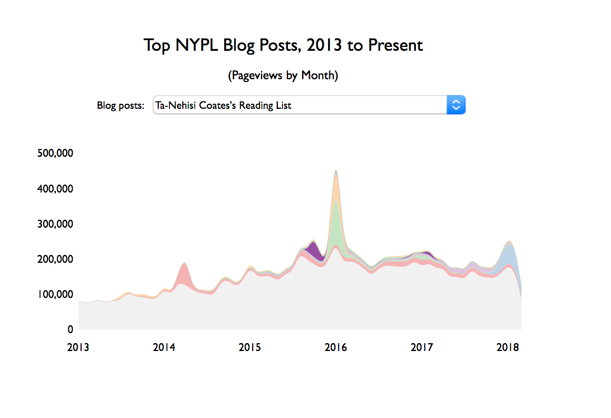

I've done a lot of data analysis and visualization over the years. The examples below are not meant to be an exhaustive list but rather a sampling of the kinds of things I've explored over the last decade. 

My primary data extraction, parsing and analysis setup these days is Python + Pandas (with Dask where necessary), whereas I've come to really appreciate R for secondary analysis and visualization.

If anything here sparks interest or questions about content, context, or
process, don't hesitate to let me know -- josh.hadro @ google mail. 

---

## PixPlot DPLA Fourth of July Images

A visualization of 7,384 "Fourth of July" (and related search) images from the Digital Public Library of America (DPLA), which aggregates cultural heritage metadata from thousands of institutions.

Under the hood is a WebGL model of how the Inception Convolutional Neural Network perceives "relatedness" and then a mapping of the computed relationships into 3-dimensional space using UMAP algorithm such that similar images appear near each other.

## Large-scale analysis

A large-scale analysis of metadata associated with the 16M+ volumes in the Hathitrust Digital Library repository matched against ~200M usage analytics events from the PageTurner tool on hathitrust.org. This analysis is based on Google Analytics event triggers from January 2014 through mid-June 2018, the time that this version of the report was compiled.

- [HathiTrust Usage Analytics and Metadata Analysis](https://hadro.github.io/hathi_analysis/analysis.html)

## Interactive

- [DPLA Hub clicks-per-item comparison, 2014-2017](https://hadro.github.io/data-analysis-and-viz-examples/dpla_hubs/half_year_dpla_hubs.html)

Comparing the DPLA Hubs in terms of average clicks per item

- [HathiTrust Volumes and Usage by Year of Publication](https://hadro.github.io/hathi_analysis/percentage_years.html)

A viz of the metadata for all volumes in HathiTrust, including all open volumes and all limited view volumes by year of publication.

- [NYPL Top Blog Posts Streamgraph](https://hadro.github.io/data-analysis-and-viz-examples/nypl_blogs/NYPL_blogs_streamgraph.html)

Quick viz of the Top NYPL blog posts of the last decade, with an eye toward how certain top posts persist over the years.

## Other viz

[!["Pratt 654 Evalautions"][evaluations]](./images/evaluations.png)

Visualizing the course evaluations I've received over 11 semesters of teaching the same course. 

[!["HathiTrust ranked referrers"][hathi_referrers]](./images/hathitrust_referrers_bump_chart_solo.png)

High-level view of top referrers to works in HathiTrust and changes in those ranks. 

[!["text message analysis"][text_messages]](./images/Josh_text_messages.jpg)

I examined every text message I've ever sent since 2008, and looked at my use of punctuation. I found a stark decline in the use of periods at the end of text messages, with an eventual interesting replacement of those with emoji to communicate more subtle and nuanced conclusions.

[!["HathiTrust Search Word Cloud"][hathi_cloud]](./images/hathi_search_queries.png)

A reduction of the hundreds of millions of words used as search queries on HathiTrust, stemmed and proportionally scaled, and then placed used an image mask.

[!["Building Inspector Cloud lower Manhattan"][building_inspector]](./images/streets_8-48.png)

Visualization of the most common toponyms for Manhattan in 1854.

[!["Public Domain works in Subway Library][subway_library]](./images/subway_library_public_domain.png)

Faceted viz of the performance of public domain works in the Subway Library campaign in the summer of 2017. 

[!["NYPL titles in Hathitrust TSNE"][nypl_in_hathi_tsne]](./images/nypl_in_hathi.png)

Experiment using doc2vec and using just volume titles to experiment with relatedness and potential recommendation engines.

[evaluations]: ./images/evaluations_700.png "Pratt 654 Evaluations"
[hathi_cloud]: ./images/hathi_search_queries_700.png "HathiTrust Search Word Cloud"
[hathi_referrers]: ./images/hathitrust_referrers_bump_chart_solo_700.png "HathiTrust ranked referrers"
[text_messages]: ./images/Josh_text_messages_700.jpg "Text message analysis"
[nypl_in_hathi_tsne]: ./images/nypl_in_hathi_700.png "NYPL titles in HathiTrust TSNE"
[building_inspector]: ./images/streets_8-48_700.png "Buildling Inspector Cloud lower Manhattan"
[subway_library]: ./images/subway_library_public_domain_700.png "Public Domain works in Subway Library"
[dpla_use]: ./images/dpla_hubs_use_per_item_six_months_700.gif "DPLA Hubs User Per Item"
