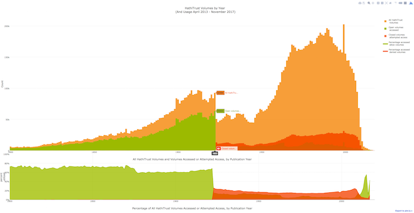

Placeholder repo for some simple data viza examples I want hosted

## PixPlot DPLA Fourth of July Images

A visualization of 7,384 "Fourth of July" (and related search) images from the Digital Public Library of America (DPLA), which aggregates cultural heritage metadata from thousands of institutions.

Under the hood is a WebGL model of how the Inception Convolutional Neural Network perceives "relatedness" and then a mapping of the computed relationships into 3-dimensional space using UMAP algorithm such that similar images appear near each other.

## Large-scale analysis

A large-scale analysis of metadata associated with the 16M+ volumes in the Hathitrust Digital Library repository matched against usage analytics from the PageTurner tool on hathitrust.org. This analysis is based on Google Analytics event triggers from January 2014 through mid-June 2018, the time that this version of the report was compiled.

- [HathiTrust Usage Analytics and Metadata Analysis](https://hadro.github.io/hathi_analysis/analysis.html)

## Interactive

- [DPLA Hub clicks-per-item comparison, 2014-2017](https://hadro.github.io/data-analysis-and-viz-examples/dpla_hubs/half_year_dpla_hubs.html)

- [HathiTrust Volumes and Usage by Year of Publication](https://hadro.github.io/hathi_analysis/percentage_years.html)

- [NYPL Top Blog Posts Streamgraph](https://hadro.github.io/data-analysis-and-viz-examples/nypl_blogs/NYPL_blogs_streamgraph.html)

## Other viz

[!["Pratt 654 Evalautions"][evaluations]](./images/evaluations.png)
[!["HathiTrust ranked referrers"][hathi_referrers]](./images/hathitrust_referrers_bump_chart_solo.png)
[!["text message analysis"][text_messages]](./images/Josh_text_messages.jpg)
[!["HathiTrust Search Word Cloud"][hathi_cloud]](./images/hathi_search_queries.png)
[!["Building Inspector Cloud lower Manhattan"][building_inspector]](./images/streets_8-48.png)
[!["Public Domain works in Subway Library][subway_library]](./images/subway_library_public_domain.png)
[!["NYPL titles in Hathitrust TSNE"][nypl_in_hathi_tsne]](./images/nypl_in_hathi.png)

[evaluations]: ./images/evaluations_700.png "Pratt 654 Evaluations"
[hathi_cloud]: ./images/hathi_search_queries_700.png "HathiTrust Search Word Cloud"
[hathi_referrers]: ./images/hathitrust_referrers_bump_chart_solo_700.png "HathiTrust ranked referrers"
[text_messages]: ./images/Josh_text_messages_700.jpg "Text message analysis"
[nypl_in_hathi_tsne]: ./images/nypl_in_hathi_700.png "NYPL titles in HathiTrust TSNE"
[building_inspector]: ./images/streets_8-48_700.png "Buildling Inspector Cloud lower Manhattan"
[subway_library]: ./images/subway_library_public_domain_700.png "Public Domain works in Subway Library"
[dpla_use]: ./images/dpla_hubs_use_per_item_six_months_700.gif "DPLA Hubs User Per Item"
